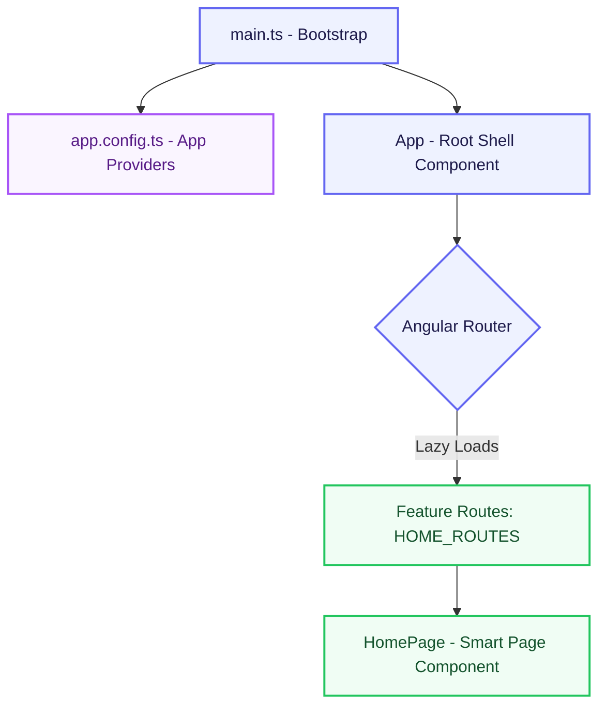
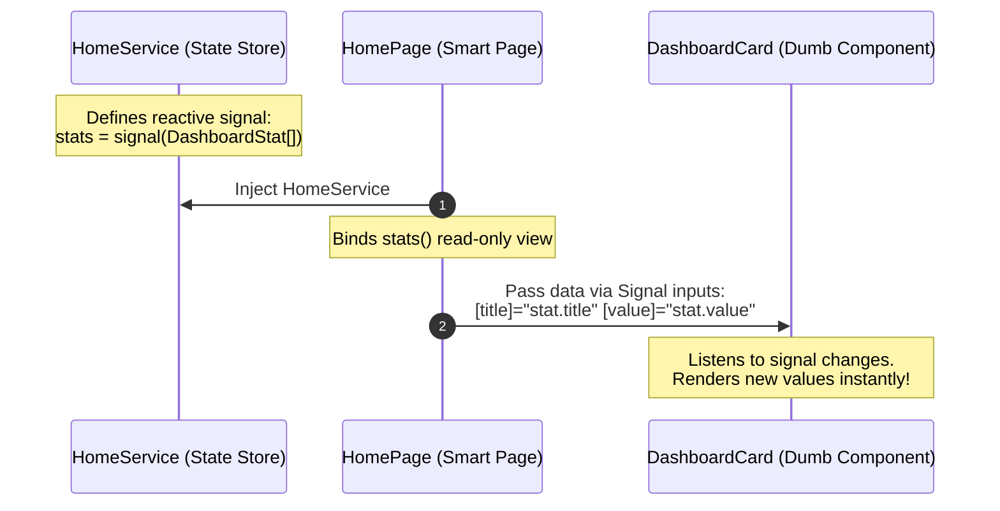

# System Architecture & Technical Design

This document details the architectural patterns, codebase layout, reactive state design, and infrastructure of the **Acme Product Management (APM) Modern Learning** application.

---

## 1. System Overview

The APM application is a modern, enterprise-grade Angular 20 SPA designed around **Standalone Components**, reactive state with **Angular Signals**, modular **Feature-Driven Architecture**, and a fully containerized **Docker Development Environment**.



---

## 2. Directory Layout & Modular Structure

The codebase is organized into modular directories where each feature encapsulates its own views, logic, data definitions, and routing.

```
angular20-apm-modern-learning/
├── .vscode/                 # IDE Configuration
├── public/                  # Public assets
├── src/
│   ├── app/
│   │   ├── app.config.ts    # Application global providers
│   │   ├── app.routes.ts    # Global route registry
│   │   ├── app.ts           # Root application shell component
│   │   ├── app.html         # Shell layout template
│   │   ├── app.scss         # Global root component styles
│   │   └── features/        # Feature domains folder
│   │       └── home/        # Home/Dashboard Feature Module
│   │           ├── components/  # Presentational (Dumb) Components
│   │           │   ├── dashboard-card/
│   │           │   └── quick-action/
│   │           ├── models/      # Domain models & type definitions
│   │           ├── pages/       # Orchestrator (Smart) Page Components
│   │           │   └── home-page/
│   │           ├── services/    # Business logic & reactive state
│   │           └── routes.ts    # Feature-specific lazy routes
│   ├── index.html           # Main SPA HTML container
│   ├── main.ts              # Entry-point bootstrapping Angular
│   └── styles.scss          # Global TailwindCSS & base styles
├── Dockerfile               # Build instruction for Node container
├── docker-compose.yml       # Dev setup with local volumes
└── tailwind.config.js       # CSS customization config
```

### Module Boundary Roles
- **Pages (Smart Components)**: Orchestrate the page view. They inject Injectable Services, subscribe to reactive signals, handle routing events, and bind state data down to subcomponents.
- **Components (Dumb Components)**: Presentational elements. They do not know about services or store state. They receive all inputs via standard Angular Signals inputs (`input()`) and communicate back to smart components using standard outputs or event emitters.
- **Services (Injectables)**: House business logic, external API integration, and represent the **Single Source of Truth** for state using Signals.
- **Models**: Simple interfaces and types ensuring static compile-time type-safety across features.

---

## 3. Reactive State & Unidirectional Data Flow

State management in this application utilizes native **Angular Signals** (`signal<T>()` and `input()`). This approach avoids unnecessary change detection cycles and establishes a clean, predictable, unidirectional data flow.



- **Signals**: Declare reactive values (e.g., `stats = signal<DashboardStat[]>([...])` in `HomeService`).
- **Signal Inputs**: Used by child components (`title = input.required<string>()` in `DashboardCard`) to enforce compile-time input checks and fine-grained change tracking.

---

## 4. Environment & Development Loop

To guarantee consistency across different developer machines and production environments, the project incorporates a complete containerized architecture.

```mermaid
graph LR
    classDef dev fill:#fff7ed,stroke:#ea580c,stroke-width:2px,color:#7c2d12;
    classDef docker fill:#f0f9ff,stroke:#0284c7,stroke-width:2px,color:#0c4a6e;
    classDef browser fill:#fdf2f8,stroke:#db2777,stroke-width:2px,color:#701a75;

    Developer([Local File System]):::dev -->|Mounts Workspace via Docker Volume| Volume[(/app Volume)]:::docker
    Volume --> Engine[Docker Compose Host]:::docker
    Engine --> Container[Angular Dev Server inside node:22-alpine Container]:::docker
    Container -->|Vite / Esbuild Dev Server| Port[Exposed Port 4200]:::docker
    Port --> Browser([Host Browser - http://localhost:4200]):::browser
    Browser -.->|Hot Reload / Live Updates| Developer
```



- **Docker Volume Mounting**: Allows modifications on the local host to trigger automated live-reloads inside the containerized app instantly.
- **Node-22-Alpine Image**: Minimizes image overhead while providing a secure, lightweight runtime.
