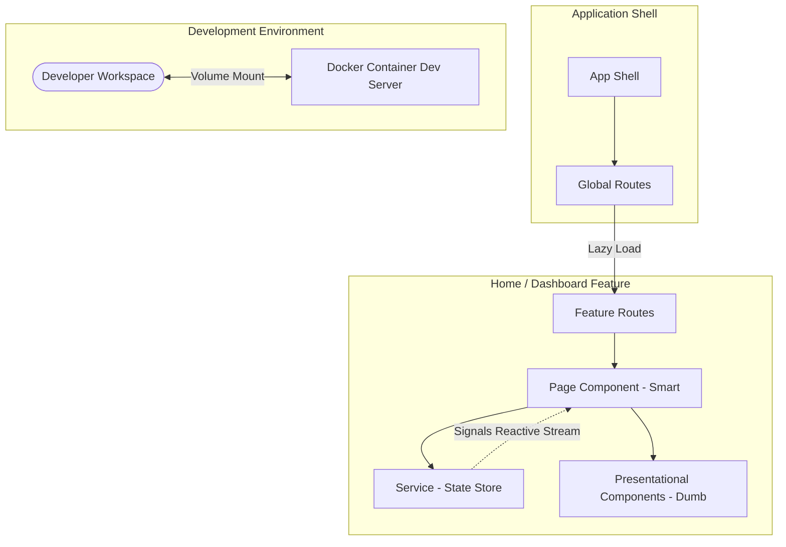

# angular20-apm-modern-learning
Modern Angular 20 learning journey based on APM application using Standalone Components, Signals, Docker and enterprise architecture.
## Architecture Overview

This project uses a modular, enterprise-grade architecture pattern designed around Standalone Components, feature boundaries, and reactive unidirectional data flow powered by Angular Signals.

For a detailed breakdown of core patterns, codebase layout, and reactive flow diagrams, please refer to the dedicated **[ARCHITECTURE.md](ARCHITECTURE.md)** guide.



## Setup Instructions

### Prerequisites
- Node.js 20.x or later
- npm 10.x or later
- Optional: Docker and Docker Compose, if you want to run the app in a container

### Local development
1. Install dependencies:
   ```bash
   npm install
   ```
2. Start the Angular development server:
   ```bash
   npm start
   ```
3. Open the app in your browser:
   ```
   http://localhost:4200
   ```

### Run tests
```bash
npm test
```

### Docker
1. Build and start the container:
   ```bash
   docker compose up --build
   ```
2. Open the app in your browser:
   ```
   http://localhost:4200
   ```

### Notes
- The repo uses Angular 20 and standalone components.
- `npm start` runs `ng serve`.
- Docker exposes port `4200` and mounts the app source for live reload.
