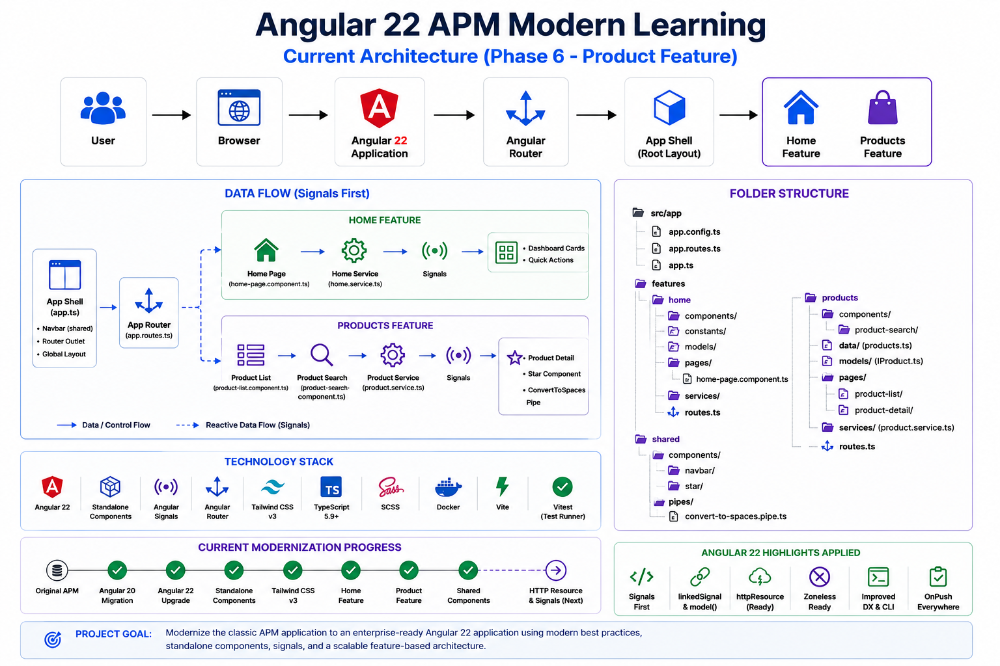
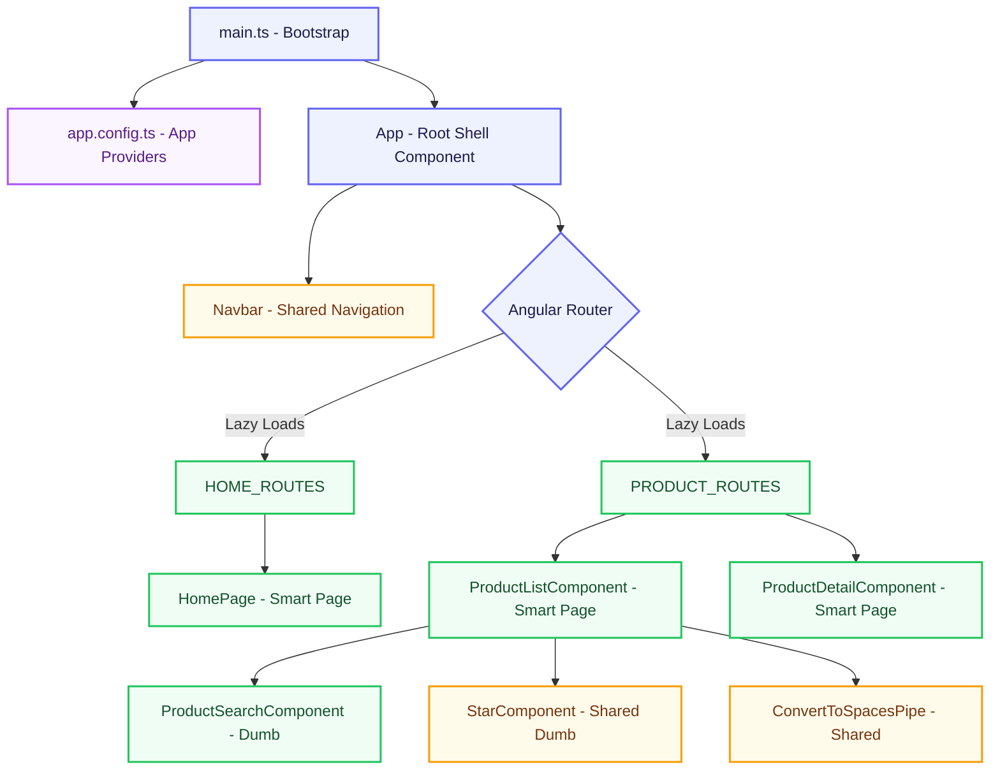
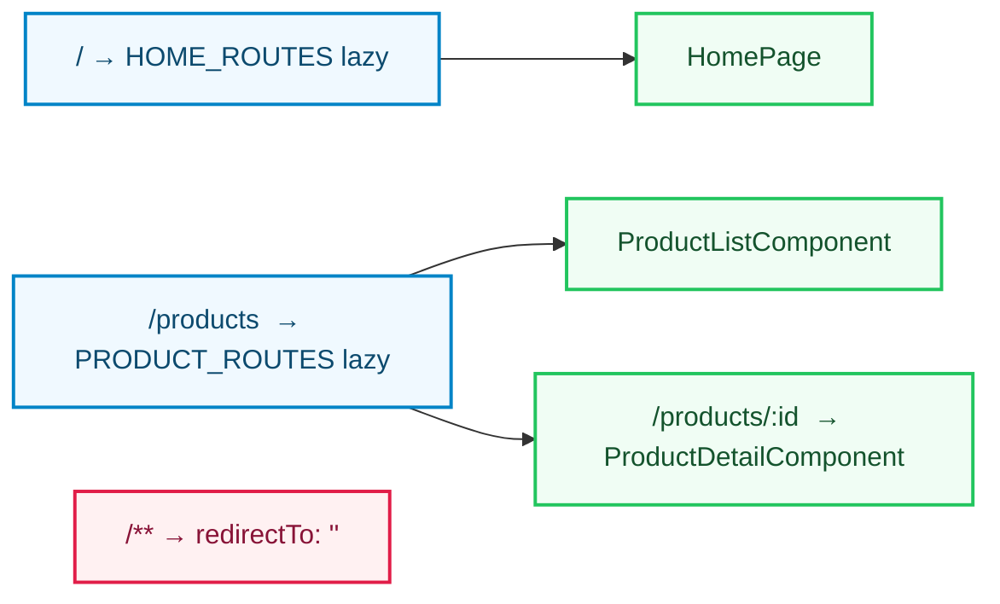
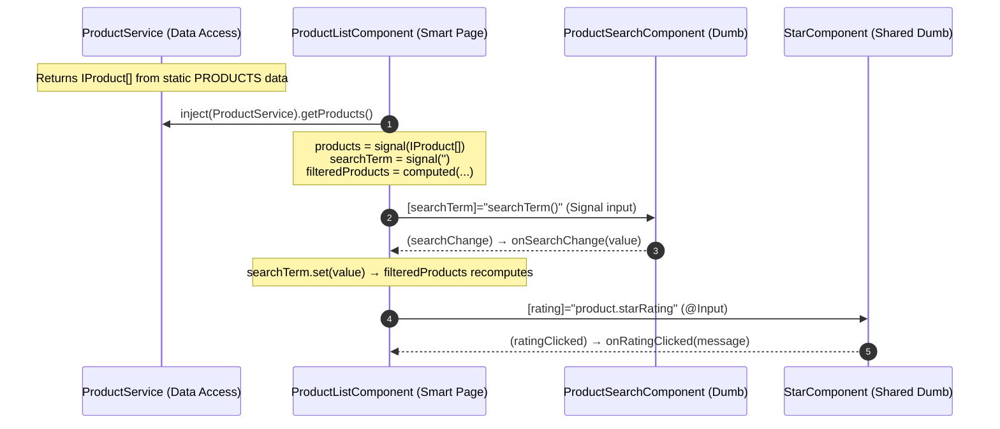
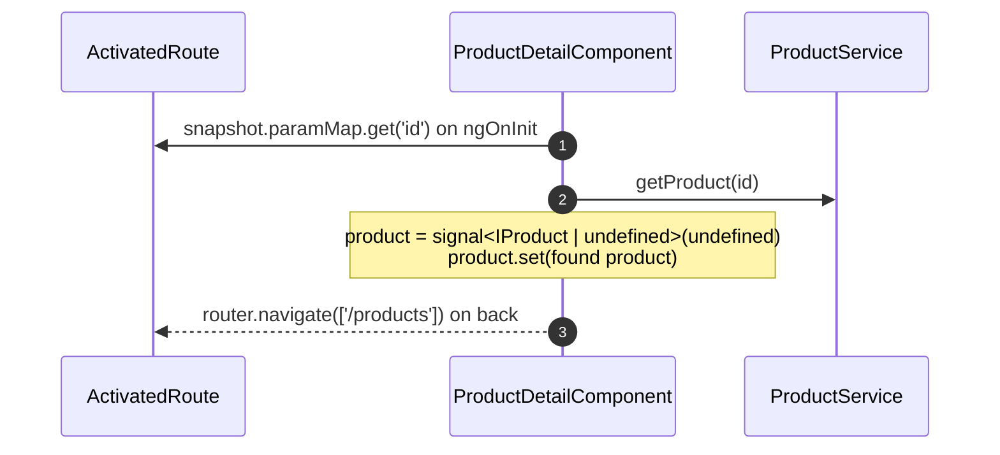

# Current Architecture Design

This document details the active technical state of the **Acme Product Management (APM) Modern Learning** application, built using Angular 22.



---

## 1. Modular & Standalone Layout

The application has eliminated legacy Angular modules (`NgModule`) in favor of **Standalone Components**. This reduces boilerplate and introduces strict, clean component boundaries.

### High-Level Component & Service Structure



---

## 2. Directory Layout & Roles

The codebase organizes directories by features and a shared library to enforce separation of concerns and cross-feature reusability.

```
src/app/
├── app.config.ts          # Global dependency injection providers
├── app.routes.ts          # Core router configurations (lazy loads home & products)
├── app.ts                 # Root shell component (hosts Navbar + router-outlet)
├── features/              # Feature-driven boundaries
│   ├── home/              # Home feature
│   │   ├── components/    # Presentational (Dumb) components
│   │   ├── constants/     # Feature-scoped constant values
│   │   ├── models/        # Domain interfaces & type definitions
│   │   ├── pages/         # Smart Orchestrator Pages (e.g. HomePage)
│   │   ├── services/      # Business logic & reactive state management
│   │   └── routes.ts      # Lazy-load feature route config (HOME_ROUTES)
│   └── products/          # Products feature
│       ├── components/    # Presentational (Dumb) components
│       │   └── product-search/  # ProductSearchComponent
│       ├── data/          # Static in-memory data (products.ts)
│       ├── models/        # IProduct interface
│       ├── pages/         # Smart Orchestrator Pages
│       │   ├── product-list/    # ProductListComponent (route: /products)
│       │   └── product-detail/  # ProductDetailComponent (route: /products/:id)
│       ├── services/      # ProductService (data access layer)
│       └── routes.ts      # Lazy-load feature route config (PRODUCT_ROUTES)
└── shared/                # Cross-feature reusable building blocks
    ├── components/
    │   ├── navbar/        # Navbar - global navigation shell
    │   └── star/          # StarComponent - reusable star rating display
    └── pipes/
        └── convert-to-spaces.pipe.ts  # ConvertToSpacesPipe
```

### Modular Directory Roles
- **Pages (Smart / Container Components)**: Manage page layout, route integration, and inject data-fetching services. They stream state down to presentational components.
- **Components (Presentational / Dumb Components)**: Focus entirely on visual layout. They receive Signal inputs (`input()`) or `@Input()` decorator-based inputs, render values, and emit events upward to Smart Components.
- **Services**: Act as the **Single Source of Truth** for data access. `ProductService` provides synchronous in-memory data lookup via `PRODUCTS` static data.
- **Models**: Simple, type-safe data structure declarations (e.g. `IProduct`).
- **Shared**: Cross-feature components (`Navbar`, `StarComponent`) and utilities (`ConvertToSpacesPipe`) live here and are imported directly by any feature that needs them.

---

## 3. Routing Architecture

The app uses Angular's **lazy-loaded feature routes** registered at the root `app.routes.ts` level.



| Path | Component | Route File |
|---|---|---|
| `/` | `HomePage` | `home/routes.ts` → `HOME_ROUTES` |
| `/products` | `ProductListComponent` | `products/routes.ts` → `PRODUCT_ROUTES` |
| `/products/:id` | `ProductDetailComponent` | `products/routes.ts` → `PRODUCT_ROUTES` |
| `/**` | Redirect to `/` | `app.routes.ts` |

---

## 4. Reactive State via Angular Signals

The system utilizes native **Angular Signals** (`signal<T>()`, `computed()`, `input()`, and `output()`) for fine-grained change detection.

### Products Feature – Signal Data Flow



### ProductDetailComponent – Route-Driven Signal State



---

## 5. Shared Library

The `src/app/shared/` directory contains cross-feature reusable pieces that are imported directly (standalone) without a barrel module.

| Artifact | Type | Key Details |
|---|---|---|
| `Navbar` | Standalone Component | Global nav using `RouterLink` + `RouterLinkActive` for Home and Products links |
| `StarComponent` (`pm-star`) | Standalone Component | Renders star rating via `@Input() rating` and `@Output() ratingClicked`; uses `OnChanges` to recalculate `cropWidth` |
| `ConvertToSpacesPipe` | Standalone Pipe | Replaces a character (e.g. `-`) with spaces in product code display |

---

## 6. Containerized Local Development

The workspace is fully containerized using **Docker** and **Docker Compose** to ensure localized developer environment consistency with zero environmental friction.

```mermaid
graph LR
    classDef dev fill:#fff7ed,stroke:#ea580c,stroke-width:2px,color:#7c2d12;
    classDef docker fill:#f0f9ff,stroke:#0284c7,stroke-width:2px,color:#0c4a6e;
    classDef browser fill:#fdf2f8,stroke:#db2777,stroke-width:2px,color:#701a75;

    Developer([Local File System]):::dev -->|Mounts Workspace via Docker Volume| Volume[(/app Volume)]:::docker
    Volume --> Engine[Docker Compose Host]:::docker
    Engine --> Container[Angular Dev Server inside node:22-alpine Container]:::docker
    Container -->|Vite / Esbuild Dev Server| Port[Exposed Port 4200]:::docker
    Port --> Browser([Host Browser - http://localhost:4200]):::browser
    Browser -.->|Hot Reload / Live Updates| Developer
```


