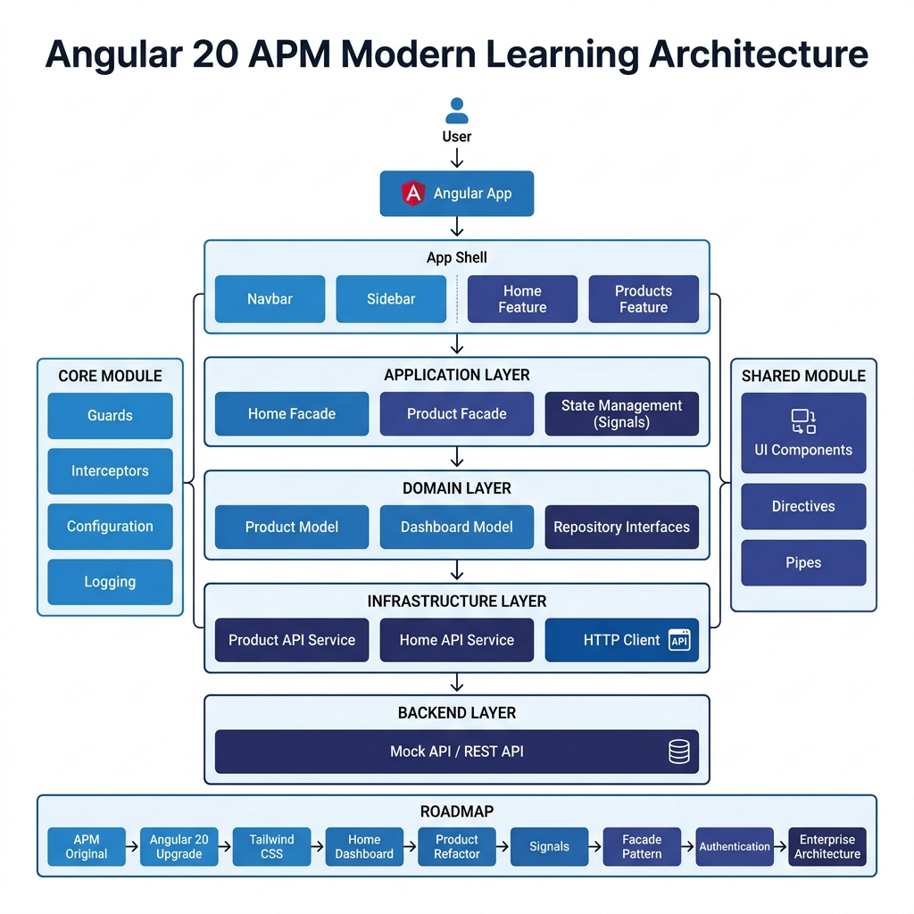
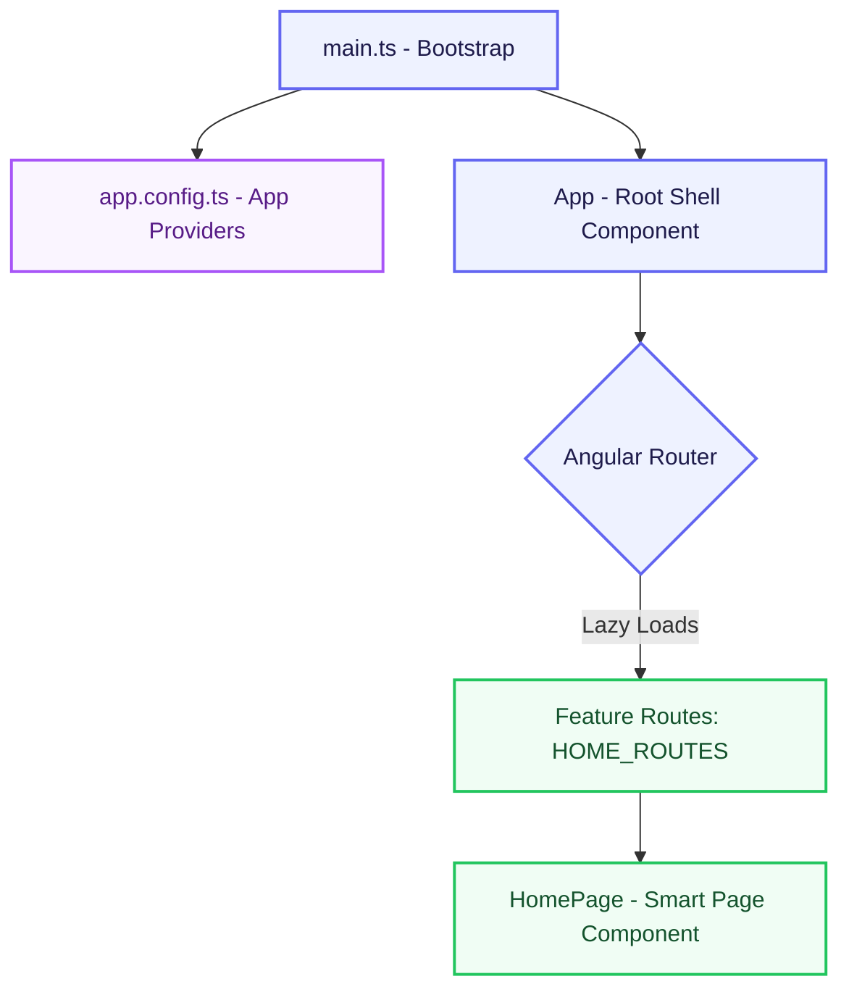
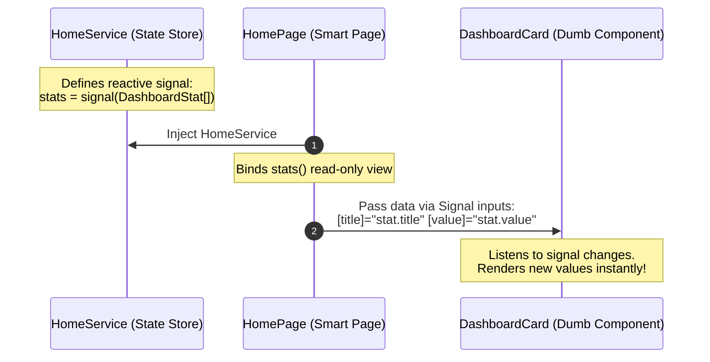

# Current Architecture Design

This document details the active technical state of the **Acme Product Management (APM) Modern Learning** application, built using Angular 20.



---

## 1. Modular & Standalone Layout

The application has eliminated legacy Angular modules (`NgModule`) in favor of **Standalone Components**. This reduces boilerplate and introduces strict, clean component boundaries.

### High-Level Component & Service Structure



---

## 2. Directory Layout & Roles

The codebase organizes directories by features to enforce separation of concerns and component reusability.

```
src/app/
├── app.config.ts       # Global dependency injection providers
├── app.routes.ts       # Core router configurations
├── app.ts              # Root shell component class
├── app.html            # Main viewport structure containing <router-outlet />
├── app.scss            # Global root shell component styling
└── features/           # Feature-driven boundaries
    └── home/           # Home Module Folder
        ├── components/ # Presentational (Dumb) Components (e.g. DashboardCard, QuickAction)
        ├── models/     # Domain interfaces & type definitions (e.g. DashboardStat)
        ├── pages/      # Smart Orchestrator Pages (e.g. HomePage)
        ├── services/   # Business logic & local reactive state management
        └── routes.ts   # Lazy-load feature route configuration
```

### Modular Directory Roles
- **Pages (Smart / Container Components)**: Manage page layout, route integration, and inject data-fetching services. They stream state down to presentational components.
- **Components (Presentational / Dumb Components)**: Focus entirely on visual layout. They take Signal inputs (`input()`), render values, and trigger outputs/events up to Smart Components without managing external service state.
- **Services**: Act as the **Single Source of Truth** for state management, leveraging Angular Signals for modern reactive bindings.
- **Models**: Simple, type-safe data structure declarations.

---

## 3. Reactive State via Angular Signals

The system utilizes native **Angular Signals** (`signal<T>()` and `input()`) for fine-grained change detection and state updates, preventing unnecessary rendering cycles.



---

## 4. Containerized Local Development

The workspace is fully containerized using **Docker** and **Docker Compose** to ensure localized developer environment consistency with zero environmental friction.


