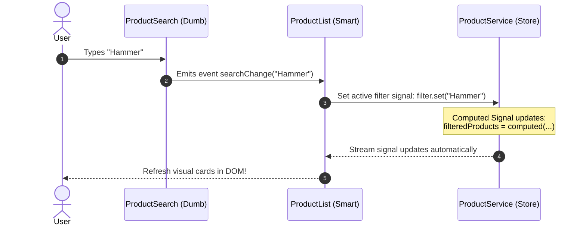

# Product Feature Architecture

This document specifies the technical design, directory structures, and reactive flows for the planned **Products** feature module—the core business component of the Acme Product Management (APM) system.

---

## 1. Feature Folder Specifications

To maintain codebase clean lines, the `features/products/` folder mirrors the modular design, dividing files by visual, logical, and structural roles.

```
src/app/features/products/
├── components/                  # Reusable presentational components (Dumb)
│   ├── product-card/            # Visual grid-card layout for a product
│   └── product-search/          # Search input and filter controller
├── models/                      # Domain interfaces
│   └── product.model.ts         # Product schema definitions
├── pages/                       # Page-level containers (Smart Components)
│   ├── product-detail/          # Renders product parameters
│   ├── product-edit/            # Handles item additions & changes
│   └── product-list/            # Displays table/grid view of items
├── services/                    # Data access and local state store
│   └── product.service.ts       # Network requests & signals cache
└── routes.ts                    # Lazy sub-routes (/products, /products/:id)
```

---

## 2. Smart vs. Dumb Component Design

The Products feature splits component responsibilities cleanly. Page-level components act as Orchestrators while visual fragments remain highly reusable.

```mermaid
graph TD
    classDef smart fill:#f0fdf4,stroke:#22c55e,stroke-width:2px,color:#14532d;
    classDef dumb fill:#fafafa,stroke:#737373,stroke-width:2px,color:#171717;
    classDef service fill:#faf5ff,stroke:#a855f7,stroke-width:2px,color:#581c87;

    Service[ProductService - Store]:::service -->|Read Signals State| Page[ProductListPage - Smart Page]:::smart
    
    Page -->|Binds Input Signals [product]| Card[ProductCardComponent - Dumb]:::dumb
    Page -->|Listens to Output Events| Search[ProductSearchComponent - Dumb]:::dumb
    
    Search -->|Emits Events 'searchChange'| Page
    Page -->|Invokes State Queries| Service
```

- **ProductListPage (Smart)**: Injectable state consumer. It tracks active search terms and products, loading them via the service and feeding them to standard child controls.
- **ProductSearchComponent (Dumb)**: Contains form controls for text input. Does not fetch data. When keywords are inputted, it triggers standard events up to the parent container.
- **ProductCardComponent (Dumb)**: Takes a single `product = input.required<Product>()` signal and displays it cleanly inside a TailwindCSS layout.

---

## 3. Reactive Search & Filtering Data Flow

Filtering and searching data follows a highly interactive, performance-optimized, unidirectional loop using Angular Signals:



1. **State Store Binding**: The service defines:
   - A raw product array signal: `products = signal<Product[]>([])`
   - A search filter string signal: `searchTerm = signal<string>('')`
   - A computed reactive list: `filteredProducts = computed(() => { ... return products().filter(...) })`
2. **Auto-Resolution**: Because `filteredProducts` is an Angular `computed` signal, any update to `searchTerm` automatically triggers an optimized visual update to the Smart component without explicit manual subscribers.

---

## 4. Product Edit/Create Form Architecture

Adding or modifying products uses Angular's **Reactive Forms** boundary, providing excellent validation control:

```typescript
import { Component, inject } from '@angular/core';
import { FormBuilder, Validators, ReactiveFormsModule } from '@angular/forms';

@Component({
  selector: 'app-product-edit',
  imports: [ReactiveFormsModule],
  templateUrl: './product-edit.html'
})
export class ProductEditPage {
  private fb = inject(FormBuilder);
  
  productForm = this.fb.group({
    productName: ['', [Validators.required, Validators.minLength(3)]],
    productCode: ['', [Validators.required]],
    price: [0, [Validators.required, Validators.min(0.01)]],
    description: ['']
  });

  onSubmit() {
    if (this.productForm.valid) {
      const payload = this.productForm.value;
      // Triggers save operation on product service
    }
  }
}
```
