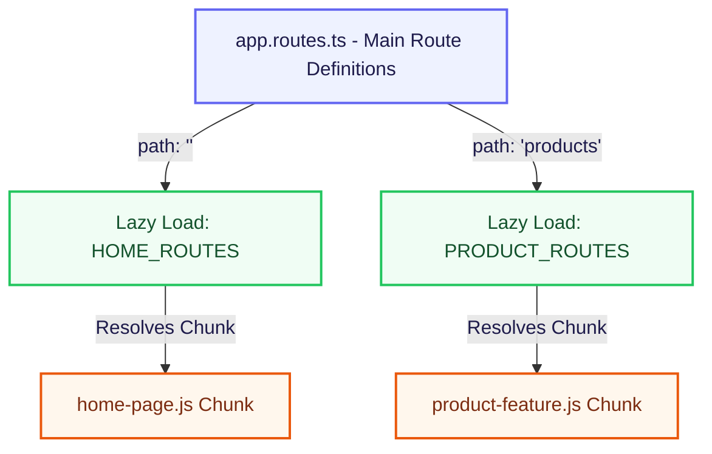
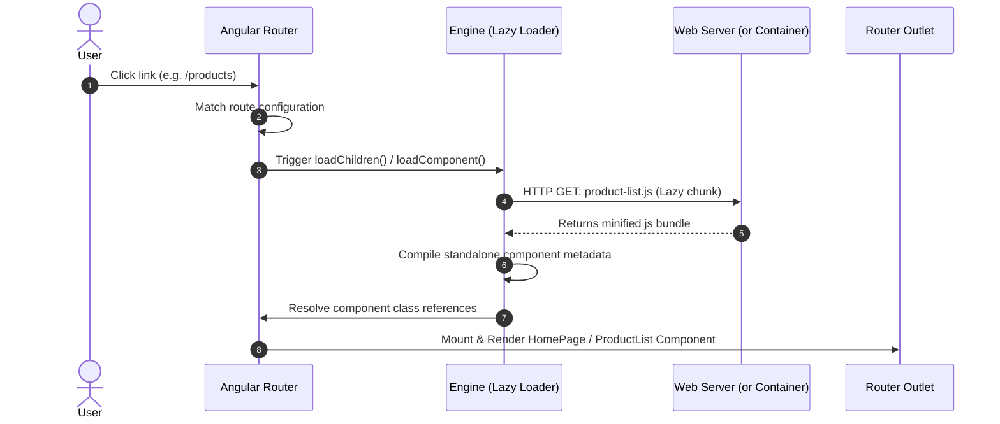
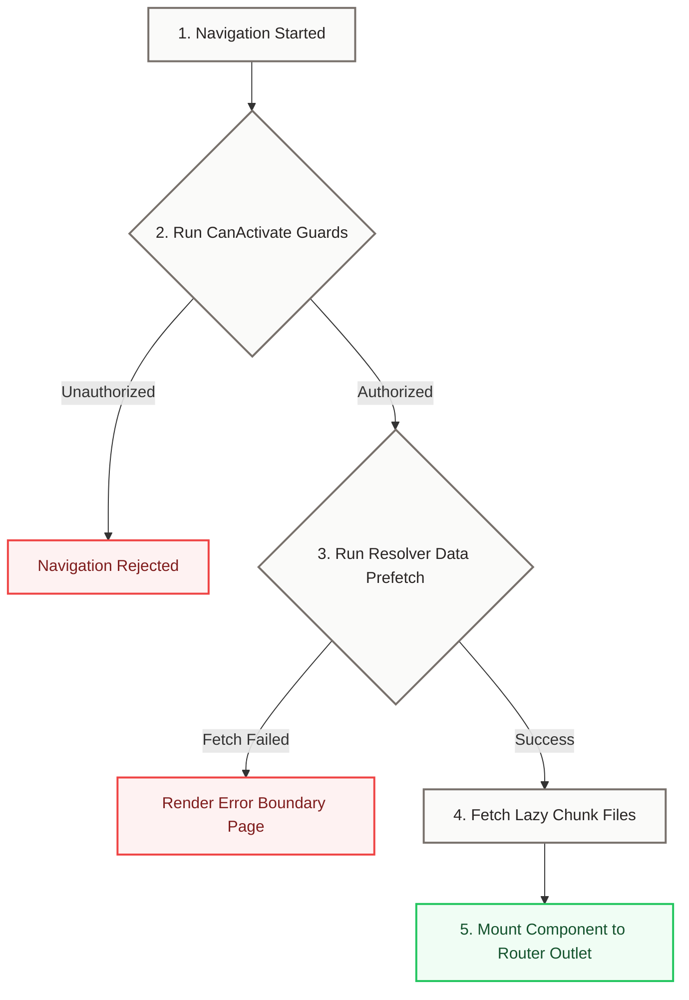

# Routing & Navigation Flow

This document details the route structure, lazy loading mechanics, and component resolution lifecycle of the application.

---

## 1. Global Routing Architecture

Routing is managed via a modern standalone design. Rather than loading all component code at application startup, the router lazy-loads separate JavaScript "chunks" for each feature module dynamically.



---

## 2. Lazy Component Loading Sequence

When a user navigates to a route, Angular triggers an asynchronous file request to fetch the corresponding standalone page bundle.



---

## 3. Navigation Lifecycle

Every navigation request goes through a strict multi-step lifecycle before any new component is loaded and mounted:



---

## 4. Current & Planned Route Mapping

The router configurations are split into clean files according to their domains:

### Root Level (`app.routes.ts`)
```typescript
import { Routes } from '@angular/router';

export const routes: Routes = [
  {
    path: '',
    loadChildren: () => import('./features/home/routes').then(m => m.HOME_ROUTES)
  },
  {
    path: 'products',
    loadChildren: () => import('./features/products/routes').then(m => m.PRODUCT_ROUTES)
  }
];
```

### Home Feature Level (`features/home/routes.ts`)
```typescript
import { Routes } from '@angular/router';

export const HOME_ROUTES: Routes = [
  {
    path: '',
    loadComponent: () => import('./pages/home-page/home-page').then(m => m.HomePage)
  }
];
```
