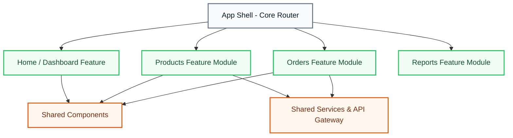
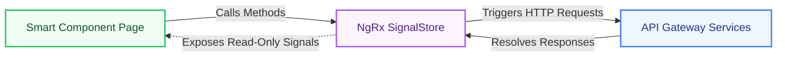
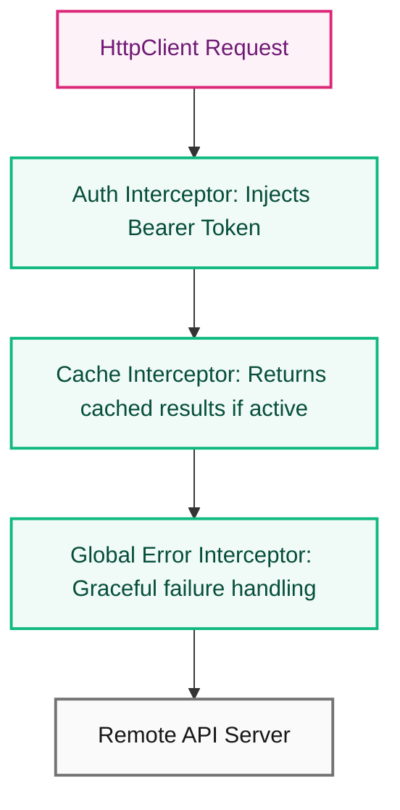
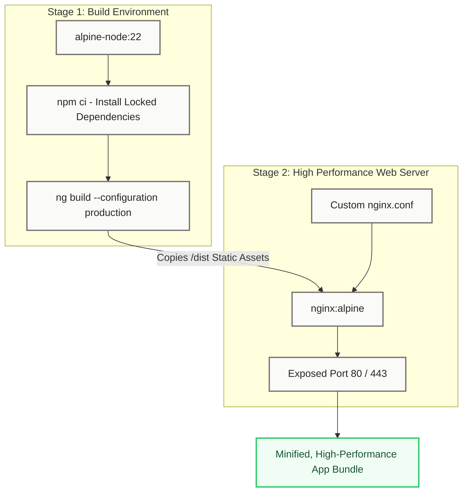

# Target Architecture (Future State)

This document maps the target architecture of the **Acme Product Management (APM)** application as it transitions from a lightweight learning repository to an enterprise-grade, scalable platform.

---

## 1. Enterprise Multi-Feature Scaling

As the platform scales to support robust inventory, ordering, and reporting domains, the modular directory structure expands to support shared resources and clean core system interfaces.

---

## 2. Advanced State Management: NgRx SignalStore

While local component signals work beautifully for page-level state, multi-feature orchestration requires a lightweight, structured state store. The target state architecture incorporates **NgRx SignalStore** to enforce predictable state transactions:

- **Declarative Features**: Enforces structural design patterns utilizing `withState()`, `withComputed()`, and `withMethods()` for cohesive state files.
- **Side Effect Control**: Incorporates standard reactive effects (`rxMethod()`) to cleanly stream async network responses directly into the signal state store.

---

## 3. API Interceptor & Security Boundaries

A robust network boundary is established using Angular HTTP Interceptors to handle global cross-cutting concerns:

- **Authentication Interceptor**: Automatically appends OAuth2 Bearer tokens to authorized domain requests.
- **Retry & Error Interceptor**: Catches failed network requests and retries automatically, or displays a global toast notification for 5xx errors.
- **Route Guards**: Route boundaries are guarded using modern standalone functional guards (`canActivate`) to check authentication state and user roles.

---

## 4. Multi-Stage Production Containerization

For local development, the app mounts local volumes. For production, the target build pipeline implements a highly optimized **Multi-Stage Dockerfile** to build static assets and serve them via a performant web server.

- **Optimized Size**: The final image contains only minified static assets and a lightweight Nginx web server, reducing the image size by over 80% compared to development runtimes.
- **Custom Router Configuration**: Configures Nginx to support SPA fallback routing (`try_files $uri $uri/ /index.html`), preventing standard 404 errors on direct navigation routes.
