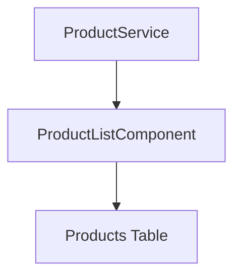
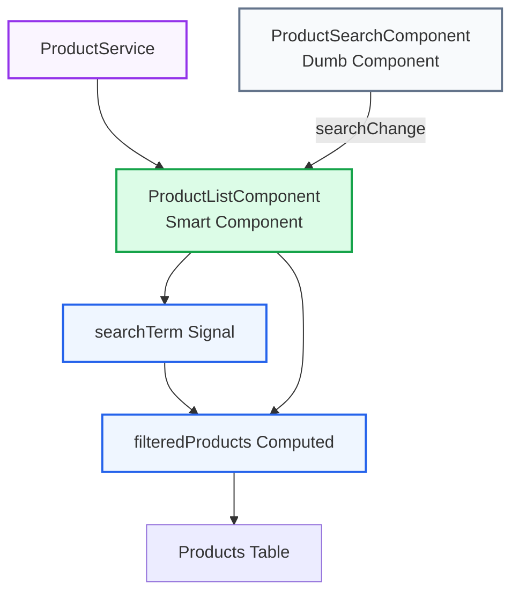
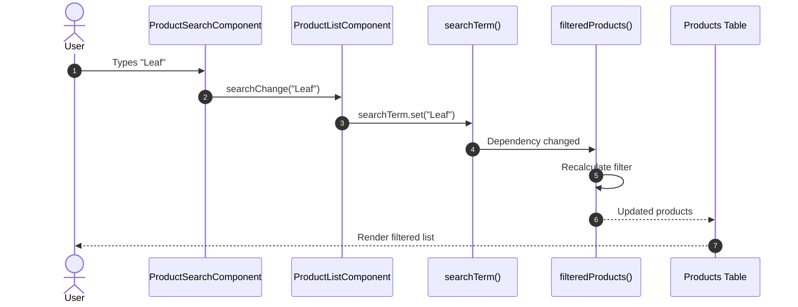
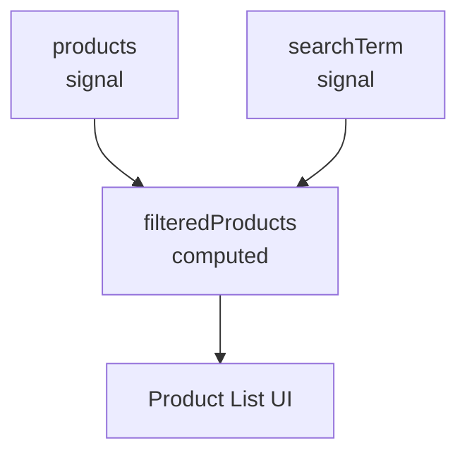

# Milestone 04: Product Filter

## Overview

In Milestone 03, users could view products loaded from the Product Service.

This milestone introduces Angular Signals for reactive state management and adds real-time product filtering. Users can search products by name, and the displayed list updates automatically without manual subscriptions or event handlers.

This milestone also introduces the first Smart vs Dumb component interaction within the Product feature architecture.

At the end of this milestone, users can:

* Search products by name
* See filtered results instantly
* View product counts
* See an empty state when no matches exist
* Understand Angular Signals and Computed Signals

---

## Objectives

* Learn Angular Signals
* Learn Computed Signals
* Create ProductSearchComponent
* Implement real-time filtering
* Introduce Smart vs Dumb component architecture
* Understand derived state
* Improve user experience with instant search

---

## Git Information

### Branch

```bash
feature/04-product-filter
```

### Tag

```bash
04-product-filter
```

---

## Project Structure

```text
src/app/features/products/
├── components/
│   ├── product-search/
│   │   └── product-search.component.ts
│   │
│   └── product-card/
│
├── models/
│   └── product.model.ts
│
├── data/
│   └── products.ts
│
├── pages/
│   └── product-list/
│       ├── product-list.component.ts
│       └── product-list.component.html
│
├── services/
│   └── product.service.ts
│
└── routes.ts
```

---

## Architecture Evolution

### Before



### After



---

## Smart vs Dumb Components

### ProductListComponent (Smart)

Responsibilities:

* Loads product data
* Owns application state
* Manages signals
* Handles filtering logic
* Passes data to child components

---

### ProductSearchComponent (Dumb)

Responsibilities:

* Displays search UI
* Emits search events
* Receives inputs
* No business logic
* No service access

---

## Reactive Data Flow



---

## Step 1: Create Product Search Component

### product-search.component.ts

```ts
import { Component, input, output } from '@angular/core';

@Component({
  selector: 'app-product-search',
  standalone: true,
  template: `
    <div class="mb-6 max-w-md">

      <label
        for="product-search"
        class="mb-2 block text-sm font-medium text-gray-700">

        Search Products

      </label>

      <div class="relative">

        <span
          class="pointer-events-none absolute inset-y-0 left-0 flex items-center pl-3 text-gray-400">

          🔍

        </span>

        <input
          id="product-search"
          #searchBox
          type="text"
          placeholder="Search products..."
          class="w-full rounded-lg border border-gray-300 bg-white py-2 pl-10 pr-4 shadow-sm transition placeholder:text-gray-400 focus:border-blue-500 focus:outline-none focus:ring-2 focus:ring-blue-200"
          [value]="searchTerm()"
          (input)="onSearch(searchBox.value)" />

      </div>

    </div>
  `
})
export class ProductSearchComponent {

  searchTerm = input('');

  searchChange = output<string>();

  onSearch(value: string): void {
    this.searchChange.emit(value);
  }

}
```

---

## Step 2: Add Signals to Product List

### product-list.component.ts

```ts
import {
  Component,
  computed,
  inject,
  signal
} from '@angular/core';

import { ProductService }
from '../../services/product.service';

@Component({
  selector: 'app-product-list',
  standalone: true,
  templateUrl: './product-list.component.html'
})
export class ProductListComponent {

  pageTitle = 'Product List';

  private productService =
    inject(ProductService);

  products = signal(
    this.productService.getProducts()
  );

  searchTerm = signal('');

  filteredProducts = computed(() => {

    const filter =
      this.searchTerm()
        .toLowerCase();

    return this.products().filter(
      product =>
        product.productName
          .toLowerCase()
          .includes(filter)
    );

  });

  onSearchChange(value: string): void {
    this.searchTerm.set(value);
  }

}
```

---

## Step 3: Update Product List Template

### product-list.component.html

```html
<div class="p-6">

  <h2
    class="mb-2 text-3xl font-bold tracking-tight text-gray-900">

    {{ pageTitle }}

  </h2>

  <p class="mb-6 text-gray-500">
    Browse and search available products.
  </p>

  <div
    class="mb-6 flex flex-col gap-4 md:flex-row md:items-end md:justify-between">

    <app-product-search
      [searchTerm]="searchTerm()"
      (searchChange)="onSearchChange($event)">
    </app-product-search>

    <span
      class="inline-flex items-center rounded-full bg-blue-100 px-3 py-1 text-sm font-medium text-blue-700">

      {{ filteredProducts().length }}
      of
      {{ products().length }}
      products

    </span>

  </div>

  @if (filteredProducts().length === 0) {

    <div
      class="rounded-lg border-2 border-dashed border-gray-300 bg-gray-50 p-8 text-center">

      <div class="mb-2 text-4xl">
        🔍
      </div>

      <h3 class="font-medium text-gray-700">
        No products found
      </h3>

      <p class="mt-1 text-sm text-gray-500">
        Try a different search term.
      </p>

    </div>

  } @else {

    <div class="overflow-x-auto">

      <table class="min-w-full border">

        <thead>
          <tr>
            <th class="border p-2">Image</th>
            <th class="border p-2">Name</th>
            <th class="border p-2">Code</th>
            <th class="border p-2">Available</th>
            <th class="border p-2">Price</th>
            <th class="border p-2">5 Star Rating</th>
          </tr>
        </thead>

        <tbody>

          @for (
            product of filteredProducts();
            track product.productId
          ) {

            <tr>

              <td class="border p-2">

                <div
                  class="flex items-center justify-center">

                  

                </div>

              </td>

              <td class="border p-2">
                {{ product.productName }}
              </td>

              <td class="border p-2">
                {{ product.productCode }}
              </td>

              <td class="border p-2">
                {{ product.releaseDate }}
              </td>

              <td class="border p-2">
                {{ product.price | currency }}
              </td>

              <td class="border p-2">
                {{ product.starRating }}
              </td>

            </tr>

          }

        </tbody>

      </table>

    </div>

  }

</div>
```

---

## Angular Concepts Learned

### signal()

Creates reactive local state.

```ts
searchTerm = signal('');
```

Benefits:

* Simple
* Reactive
* No subscriptions
* Fine-grained updates

---

### computed()

Creates derived state.

```ts
filteredProducts = computed(...)
```

Benefits:

* Automatic recalculation
* Dependency tracking
* Cached results
* Better performance

---

### Derived State

Instead of storing filtered data separately:

```ts
filteredProducts = computed(...)
```

Benefits:

* No duplication
* Single source of truth
* Easier maintenance

---

### Smart Components

Contain:

```text
Services
Signals
State
Business Logic
```

Example:

```text
ProductListComponent
```

---

### Dumb Components

Contain:

```text
Inputs
Outputs
UI
```

Example:

```text
ProductSearchComponent
```

---

### Angular 20 Control Flow

Using:

```html
@for (...)
```

instead of:

```html
*ngFor
```

Benefits:

* Cleaner syntax
* Better performance
* Modern Angular pattern

---

## Signals Architecture



---

## Validation Checklist

* [ ] ProductSearchComponent created
* [ ] Search box styled with Tailwind
* [ ] searchTerm signal implemented
* [ ] filteredProducts computed signal implemented
* [ ] Product count displayed
* [ ] Empty state implemented
* [ ] Filtering works correctly
* [ ] Smart/Dumb architecture established
* [ ] Application builds successfully

---

## Commit History

### Commit 1

```bash
git commit -m "feat(products): add signal-based product filtering with smart and dumb components"
```

---

### Commit 2

```bash
git commit -m "feat(products): add milestone 04 for signal-based product filtering and smart/dumb component architecture"
```

---

## Pull Request

### Title

```text
feat(products): add signal-based product filtering
```

### Description

* Added ProductSearchComponent
* Introduced Angular Signals
* Added computed filtering
* Implemented reactive search
* Added product counter
* Added empty state
* Established Smart/Dumb architecture
* Improved user experience

---

## Milestone Progress

```text
✅ 00-tailwind-complete
✅ 01-home-feature
✅ 02-navigation
✅ 03-product-list
✅ 04-product-filter
⬜ 05-product-detail
⬜ 06-star-component
⬜ 07-http-client
⬜ 08-loading-states
⬜ 09-resource-api
⬜ 10-signal-store
```

---

## Next Milestone

### Milestone 05: Product Detail

Upcoming topics:

* Route Parameters
* ActivatedRoute
* Product Lookup
* Navigation
* Master-Detail Pattern
* Route-based State
* Angular Router Integration
* Detail Page Layout
