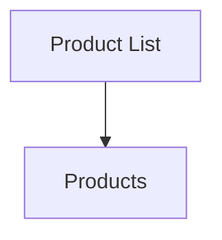
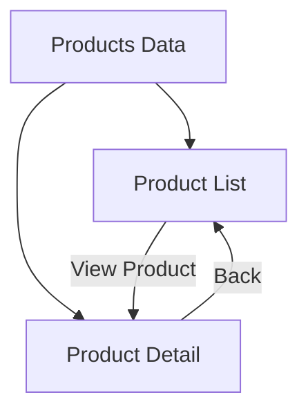
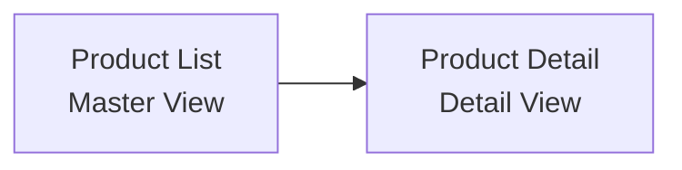
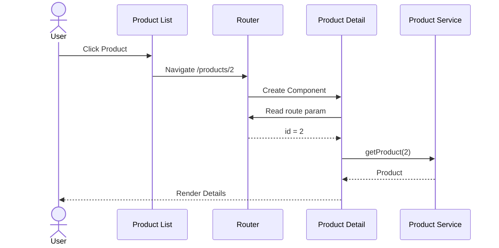

# Milestone 05: Product Detail

## Overview

In Milestone 04, users could browse and filter products using Angular Signals.

This milestone introduces the Product Detail page and Angular Router route parameters. Users can now click a product from the list and navigate to a dedicated detail page displaying additional information about the selected product.

This milestone implements the classic Master-Detail Pattern commonly used in enterprise applications.

At the end of this milestone, users can:

* Navigate from Product List to Product Detail
* Read route parameters
* Lookup products by ID
* Navigate back to the Product List
* Understand route-based state management

---

## Objectives

* Create Product Detail page
* Configure parameterized routes
* Learn ActivatedRoute
* Implement product lookup by ID
* Add navigation between pages
* Implement Master-Detail Pattern
* Understand route-based state
* Improve Angular Router knowledge

---

## Git Information

### Branch

```bash
feature/05-product-detail
```

### Tag

```bash
05-product-detail
```

---

## Project Structure

```text
src/app/features/products/
├── components/
│   ├── product-search/
│   └── product-card/
│
├── models/
│   └── product.model.ts
│
├── data/
│   └── products.ts
│
├── pages/
│   ├── product-list/
│   │   ├── product-list.component.ts
│   │   └── product-list.component.html
│   │
│   ├── product-detail/
│   │   ├── product-detail.component.ts
│   │   └── product-detail.component.html
│   │
│   └── product-edit/
│
├── services/
│   └── product.service.ts
│
└── routes.ts
```

---

## Architecture Evolution

### Before



### After



---

## Master-Detail Pattern



Benefits:

* Familiar user experience
* Clear navigation flow
* Scalable architecture
* Common enterprise pattern

---

## Step 1: Add Product Lookup to Service

### product.service.ts

```ts
import { Injectable } from '@angular/core';

import { PRODUCTS } from '../data/products';
import { Product } from '../models/product.model';

@Injectable({
  providedIn: 'root'
})
export class ProductService {

  getProducts(): IProduct[] {
    return PRODUCTS;
  }

  getProduct(
    id: number
  ): IProduct | undefined {

    return PRODUCTS.find(
      product =>
        product.productId === id
    );

  }

}
```

---

## Step 2: Create Product Detail Component

### product-detail.component.ts

```ts
import {
  Component,
  inject,
  signal
} from '@angular/core';

import {
  ActivatedRoute,
  Router
} from '@angular/router';

import { ProductService }
from '../../services/product.service';

import { IProduct }
from '../../models/product.model';

@Component({
  selector: 'app-product-detail',
  standalone: true,
  templateUrl: './product-detail.component.html'
})
export class ProductDetailComponent {

  private route =
    inject(ActivatedRoute);

  private router =
    inject(Router);

  private productService =
    inject(ProductService);

  product =
    signal<IProduct | undefined>(
      undefined
    );

  constructor() {

    const id = Number(
      this.route.snapshot.paramMap.get('id')
    );

    this.product.set(
      this.productService.getProduct(id)
    );

  }

  onBack(): void {
    this.router.navigate([
      '/products'
    ]);
  }

}
```

---

## Step 3: Create Detail Template

### product-detail.component.html

```html
@if (product(); as selectedProduct) {

  <div class="mx-auto max-w-4xl p-6">

    <button
      class="mb-6 rounded bg-gray-100 px-4 py-2 hover:bg-gray-200"
      (click)="onBack()">

      ← Back

    </button>

    <div
      class="rounded-xl border bg-white p-6 shadow-sm">

      <div
        class="grid gap-6 md:grid-cols-2">

        <div>

          

        </div>

        <div>

          <h2
            class="mb-4 text-3xl font-bold">

            {{ selectedProduct.productName }}

          </h2>

          <div class="space-y-3">

            <p>
              <strong>Code:</strong>
              {{ selectedProduct.productCode }}
            </p>

            <p>
              <strong>Release Date:</strong>
              {{ selectedProduct.releaseDate }}
            </p>

            <p>
              <strong>Price:</strong>
              {{ selectedProduct.price | currency }}
            </p>

            <p>
              <strong>Rating:</strong>
              {{ selectedProduct.starRating }}
            </p>

            <p>
              <strong>Description:</strong>
              {{ selectedProduct.description }}
            </p>

          </div>

        </div>

      </div>

    </div>

  </div>

}
```

---

## Step 4: Configure Product Routes

### routes.ts

```ts
import { Routes } from '@angular/router';

import { ProductListComponent }
from './pages/product-list/product-list.component';

import { ProductDetailComponent }
from './pages/product-detail/product-detail.component';

export const PRODUCT_ROUTES: Routes = [
  {
    path: '',
    component: ProductListComponent
  },
  {
    path: ':id',
    component: ProductDetailComponent
  }
];
```

---

## Step 5: Add Product Navigation

### product-list.component.html

Update product name:

```html
<td class="border p-2">

  <a
    class="text-blue-600 hover:underline"
    [routerLink]="[
      '/products',
      product.productId
    ]">

    {{ product.productName }}

  </a>

</td>
```

---

## Route Parameter Flow



---

## Angular Concepts Learned

### Route Parameters

Parameterized routes:

```ts
{
  path: ':id',
  component: ProductDetailComponent
}
```

Example URLs:

```text
/products/1
/products/2
/products/3
```

---

### ActivatedRoute

Access route information.

```ts
const id = Number(
  this.route.snapshot.paramMap.get('id')
);
```

---

### Route-based State

The URL becomes the source of truth.

Example:

```text
/products/2
```

State:

```ts
id = 2
```

Benefits:

* Bookmarkable
* Shareable
* Browser history support

---

### Angular Router Navigation

Programmatic navigation:

```ts
this.router.navigate([
  '/products'
]);
```

---

## Validation Checklist

* [x] Product Detail component created
* [x] Product lookup implemented
* [x] Parameterized route configured
* [x] Product name links added
* [x] Route parameter read successfully
* [x] Product detail displayed
* [x] Back button works
* [x] Application builds successfully

---

## Commit History

### Commit 1

```bash
git commit -m "feat(products): add product detail page with route-based navigation"
```

---

## Pull Request

### Title

```text
feat(products): implement product detail page
```

### Description

* Added Product Detail page
* Added route parameter support
* Implemented product lookup by ID
* Added master-detail navigation
* Integrated Angular Router
* Added back navigation

---

## Milestone Progress

```text
✅ 00-tailwind-complete
✅ 01-home-feature
✅ 02-navigation
✅ 03-product-list
✅ 04-product-filter
✅ 05-product-detail
⬜ 06-star-component
⬜ 07-http-client
⬜ 08-loading-states
⬜ 09-resource-api
⬜ 10-signal-store
```

---

## Next Milestone

### Milestone 06: Star Component

Upcoming topics:

* Reusable Components
* Input Signals
* Output Events
* Component Communication
* Rating Visualization
* Shared Components
* Presentational Components
