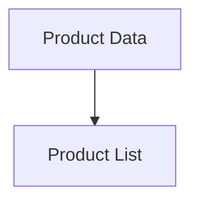
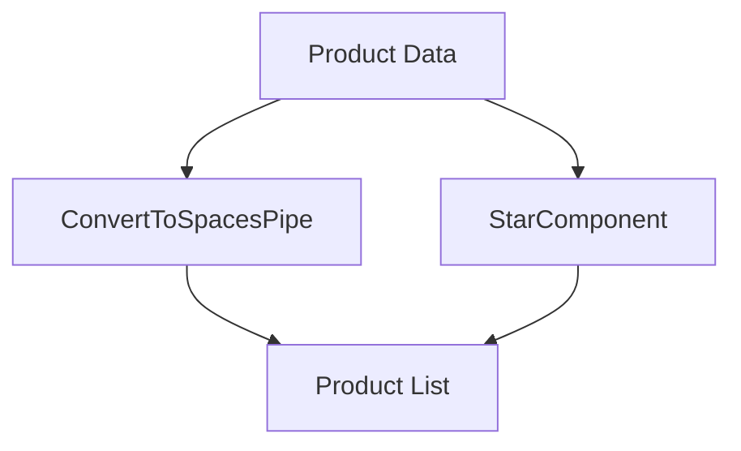
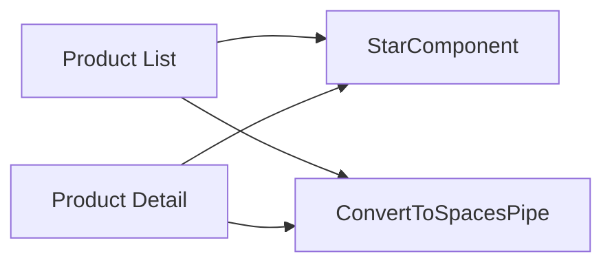
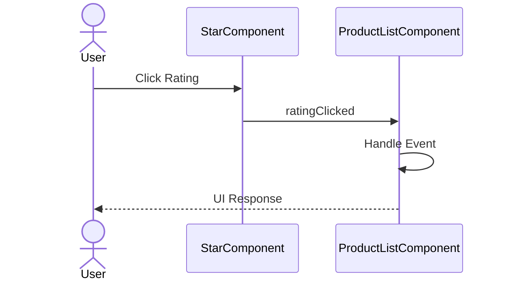
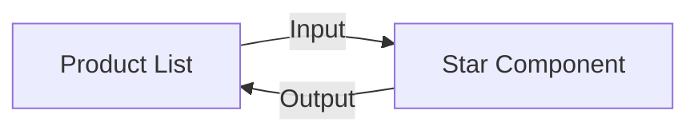

# Milestone 06: Star Component & Convert To Spaces Pipe

## Overview

In Milestone 05, users could navigate between Product List and Product Detail pages using Angular Router.

This milestone introduces the first reusable shared UI building blocks:

* StarComponent
* ConvertToSpacesPipe

The Star Component transforms numeric ratings into a visual five-star representation, while ConvertToSpacesPipe demonstrates how Angular Pipes can transform data for presentation purposes.

Unlike traditional Angular applications, this project uses modern Angular 20 Standalone Components and Standalone Pipes instead of Shared Modules.

At the end of this milestone, users can:

* Display visual star ratings
* Create reusable standalone components
* Create reusable standalone pipes
* Pass data using Inputs
* Emit events using Outputs
* Understand parent-child communication
* Build presentation-focused UI components

---

## Objectives

* Create reusable StarComponent
* Create reusable ConvertToSpacesPipe
* Learn Standalone Components
* Learn Standalone Pipes
* Learn Input properties
* Learn Output events
* Learn PipeTransform
* Understand component communication
* Build reusable UI building blocks

---

## Git Information

### Branch

```bash
feature/06-star-component
```

### Tag

```bash
06-star-component
```

---

## Project Structure

```text
src/app/
├── shared/
│   ├── pipes/
│   │   ├── convert-to-spaces.pipe.ts
│   │   └── convert-to-spaces.pipe.spec.ts
│   │
│   └── star/
│       ├── star.component.ts
│       └── star.component.spec.ts
│
├── features/
│   └── products/
│       ├── pages/
│       │   ├── product-list/
│       │   └── product-detail/
│       │
│       ├── services/
│       │   └── product.service.ts
│       │
│       └── routes.ts
│
└── app.routes.ts
```

---

## Architecture Evolution

### Before



Displayed values:

```text
4.5
GDN-0011
```

---

### After



Displayed values:

```text
★★★★☆
GDN 0011
```

---

## Shared UI Architecture



---

## Step 1: Install Font Awesome 4

Install Font Awesome:

```bash
npm install font-awesome@4
```

Update `angular.json`:

```json
"styles": [
  "node_modules/font-awesome/css/font-awesome.min.css",
  "src/styles.scss"
]
```

---

## Step 2: Create Convert To Spaces Pipe

### convert-to-spaces.pipe.ts

```ts
import { Pipe, PipeTransform } from '@angular/core';

@Pipe({
  name: 'convertToSpaces',
  standalone: true
})
export class ConvertToSpacesPipe implements PipeTransform {
  transform(value: string, character: string): string {
    return value.replace(character, ' ');
  }
}
```

---

## Step 3: Create Star Component

### star.component.ts

```ts
import { Component, EventEmitter, Input, OnChanges, Output } from '@angular/core';

@Component({
  selector: 'pm-star',
  template: `
    <div class="crop" [style.width.px]="cropWidth" [title]="rating" (click)="onClick()">
      <div style="width: 75px">
        <span class="fa fa-star"></span>
        <span class="fa fa-star"></span>
        <span class="fa fa-star"></span>
        <span class="fa fa-star"></span>
        <span class="fa fa-star"></span>
      </div>
    </div>
  `,
  styles: [
    `
      .crop {
        overflow: hidden;
      }

      div {
        cursor: pointer;
      }
    `,
  ],
})
export class StarComponent implements OnChanges {
  @Input() rating = 0;
  cropWidth = 75;

  @Output() ratingClicked = new EventEmitter<string>();

  ngOnChanges(): void {
    this.cropWidth = (this.rating * 75) / 5;
  }

  onClick(): void {
    this.ratingClicked.emit(`The rating ${this.rating} was clicked!`);
  }
}
```

---

## Step 4: Import Shared Artifacts

### product-list.component.ts

```ts
import { StarComponent }
from '../../../../shared/star/star.component';

import { ConvertToSpacesPipe }
from '../../../../shared/pipes/convert-to-spaces.pipe';

@Component({
  selector: 'app-product-list',
  standalone: true,
  imports: [
    StarComponent,
    ConvertToSpacesPipe
  ],
  templateUrl: './product-list.component.html'
})
export class ProductListComponent {}
```

---

## Step 5: Use Convert To Spaces Pipe

### Before

```html
<td>
  {{ product.productCode }}
</td>
```

### After

```html
<td>
  {{ product.productCode
      | convertToSpaces:'-' }}
</td>
```

Example:

```text
GDN-0011
```

becomes:

```text
GDN 0011
```

---

## Step 6: Replace Numeric Rating

### Before

```html
<td>
  {{ product.starRating }}
</td>
```

### After

```html
<td>

  <pm-star
    [rating]="product.starRating"
    (ratingClicked)="onRatingClicked($event)">
  </pm-star>

</td>
```

---

## Step 7: Handle Output Event

### product-list.component.ts

```ts
onRatingClicked(
  message: string
): void {

  console.log(message);

}
```

---

## Component Communication Flow



---

## Angular Concepts Learned

### Standalone Components

Reusable UI components without NgModules.

```ts
@Component({
  standalone: true
})
```

Benefits:

* Simpler architecture
* Better lazy loading
* Reduced boilerplate

---

### Standalone Pipes

Reusable presentation transformations.

```ts
@Pipe({
  standalone: true
})
```

Benefits:

* Direct imports
* Better tree-shaking
* Easier maintenance

---

### Input

Receive data from a parent component.

```ts
@Input()
rating = 0;
```

---

### Output

Send events to a parent component.

```ts
@Output()
ratingClicked =
  new EventEmitter<string>();
```

---

### PipeTransform

Transform display data.

```ts
implements PipeTransform
```

Example:

```html
{{ product.productCode
   | convertToSpaces:'-' }}
```

Output:

```text
GDN-0011
↓
GDN 0011
```

---

### Component Communication



---

### Presentational Components

Responsibilities:

* Display data
* Emit events
* No business logic
* Highly reusable

Example:

```text
StarComponent
```

---

## Validation Checklist

* [x] Font Awesome installed
* [x] ConvertToSpacesPipe created
* [x] Pipe marked standalone
* [x] StarComponent created
* [x] StarComponent marked standalone
* [x] Pipe imported into Product List
* [x] StarComponent imported into Product List
* [x] Rating visualization works
* [x] Output event works
* [x] Product code transformed correctly
* [x] Application builds successfully

---

## Commit History

### Commit 1

```bash
git commit -m "feat(shared): add standalone star component and convert-to-spaces pipe"
```

---

## Pull Request

### Title

```text
feat(shared): add standalone star component and custom pipe
```

### Description

* Added ConvertToSpacesPipe
* Added standalone StarComponent
* Installed Font Awesome 4
* Replaced numeric ratings with visual stars
* Added parent-child component communication
* Introduced standalone shared UI architecture

---

## Milestone Progress

```text
✅ 00-tailwind-complete
✅ 01-home-feature
✅ 02-navigation
✅ 03-product-list
✅ 04-product-filter
✅ 05-product-detail
✅ 06-star-component
⬜ 07-http-client
⬜ 08-loading-states
⬜ 09-resource-api
⬜ 10-signal-store
```

---

## Next Milestone

### Milestone 07: HTTP Client Integration

Upcoming topics:

* HttpClient
* provideHttpClient()
* Observable
* RxJS
* HTTP GET Requests
* JSON Data
* Async Data Loading
* Error Handling
* Service Layer Architecture
* Backend Integration
* Angular 20 HTTP Patterns
